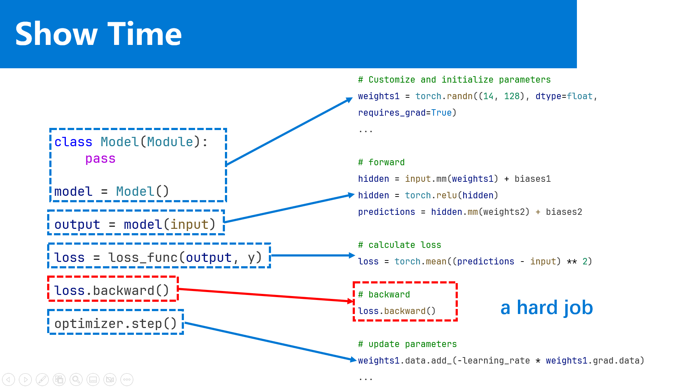
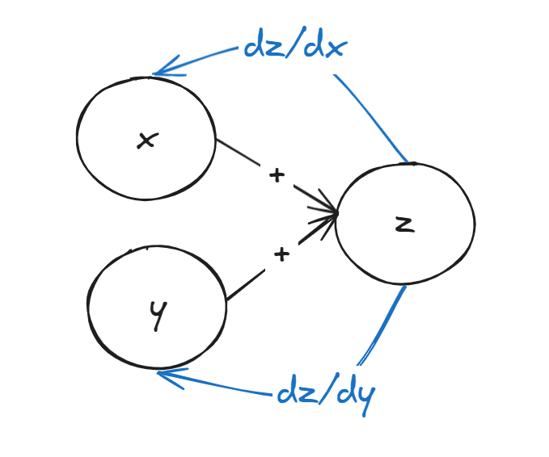
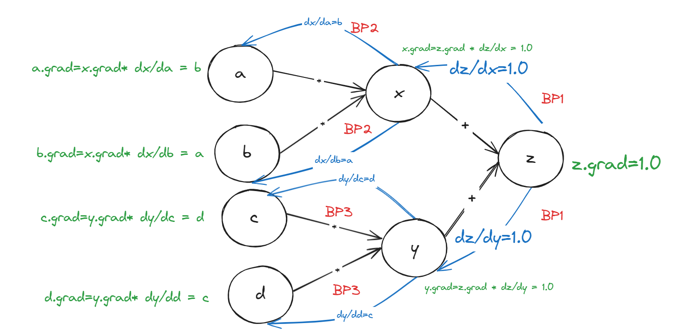
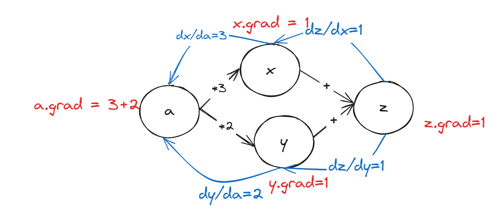

# PyCarrot 机器学习框架

项目地址：<https://github.com/CarrotWuDev/PyCarrot>

## 前言

笔者的研究方向是人工智能方向。笔者在研究生第一学期学习了《机器学习》这门课程，在学习本门课程的过程中，笔者接触了`PyTorch`这个深度学习框架，`PyTorch`让整个深度学习过程变得非常简单，开发者不需要关注框架本身的细节，只需要关注数据科学本身。

笔者也是在学习搭建神经网络的过程中了解到深度学习最重要的算法——**反向传播算法**，该算法也是深度学习的核心，正是该算法推动了深度学习的发展。

后面在《高级算法设计》这门课程中，笔者也是实现了反向传播算法，并在课程上分享了该算法。



既然笔者已经实现了深度学习的核心——BP算法，那么笔者就在BP算法的基础上构建了一个机器学习框架`PyCarrot`.
> 笔者的英文名是`CarrotWu`，所以就将该机器学习框架命名为`PyCarrot`。

## 反向传播算法（自动微分）

### 反向传播算法的介绍

反向传播的是在动微分在工程上的实现。其本质就是利用链式求导法则，从计算结果开始，将微分反向传播到各个计算节点（如`PyTorch`中的`Tensor`数据类型）。接着使用梯度对各个参数节点进行更新（优化算法），经过这样的过程，我们的模型在特定数据上会呈现`optimum`。

以表达式`z = x + y`为例：



### 反向传播算法的实现

#### 常量版本（不涉及矩阵运算）

##### 知识铺垫

在`Pytorch`中`Tensor`数据类型构建了反向传播算法的基础。因为`Tensor class`不仅存储着数据本身，还存储着**如何传递梯度？**的信息。

主要就是一下两个字段：

1. `self.grad`：节点的梯度信息。
2. `self.grad_func`：节点的梯度该如何传递到子节点，即计算子节点的梯度的函数（数学上的链式法则）。

```python
class Tensor(object):
    self.data
    self.grad
    self.grad_func
    ...
```

以表达式`z = x * y`为例，我们来说明一下上面两个字段。

假设计算节点`z`的`grad=a`，而`z`由计算节点`x`和`y`进行乘法运算得到，那么`z`的`grad_func`就存储着`z`的`grad`如何传递给`x`和`y`传递方式。所以`grad_func=[(x, grad_wrt_x), (y, grad_wrt_y)]`。

`grad_wrt_x`用数学表示是这样：

$$\frac{\partial z}{\partial x}=a*y$$

`grad_wrt_y`用数学表示是这样：

$$\frac{\partial z}{\partial y}=a*x$$

用`Python`代码实现是下面这样：

```python
def grad_wrt_x(grad):
    return grad*y

def grad_wrt_y(grad):
    return grad*x
```

##### 代码实现

下面是`Carrot`类的实现：

首先是`Carrot`类的一些属性

```python
class Carrot():
    def __init(self, data, requires_grad=False, child_nodes=[], name=None)
        self.data = data # Carrot实例中所存储的数据
        self.child_nodes = child_nodes # 子节点信息，相当于Tensor中的grad_func，其值默认为空
        self.name = name # 节点的标识信息
        self.grad = None # 节点的梯度
        self.requires_grad = requires_grad # 当前节点是否需要计算梯度
        pass
```

在我们了解了节点的重要信息之后，我们需要用节点来构建表达式。

下面我以乘法为例 $z = x \times y$

```python
x = Carrot(data=2.0, requires_grad=True, name="x")
y = Carrot(data=4.0, requires_grad=True, name="y")
```

可是`Carrot`节点之间是如何实现乘法`z = x * y`的呢？

先给出结论：

1. 实现`Carrot`实例内部数据之间的乘法。
2. 构建`z`节点的依赖信息`child_nodes`
3. 根据运算得到的内容构建新的`Carrrot`实例`z`

下面是伪代码：

```python
result_data = x.data * y.data
child_nodes = [(x, grad_wrt_x), (y, grad_wrt_y)]
requires_grad = x.requires_grad or y.requires_grad

return Carrot(result_data, child_nodes, requires_grad, name="add")

```
> 注意：使用运算符重载实现

```python
def __mul__(self, other: "Carrot") -> "Carrot":
    """
    left mul: self * other
    """
    data = self.data * other.data
    requires_grad = self.requires_grad or other.requires_grad
    child_nodes = []
    if self.requires_grad:

        def grad_wrt_self(grad):
            return grad * other.data

        child_nodes.append((self, grad_wrt_self))
    if other.requires_grad:

        def grad_wrt_other(grad):
            return grad * self.data

        child_nodes.append((other, grad_wrt_other))

    result_node = Carrot(
        data=data, child_nodes=child_nodes, name="mul", requires_grad=requires_grad
    )
    return result_node
```

我们测试一下

```python
x = Carrot(data=2.0, requires_grad=True, name="x")
y = Carrot(data=4.0, requires_grad=True, name="y")
z = x +  y
print(z.data)
print(z.requires_grad)
print(z.grad)
print(z.name)
print(z.child_nodes[0][0])
print(z.child_nodes[0][1])
print(z.child_nodes[1][0])
print(z.child_nodes[1][1])
---
8.0
True
0
mul
<__main__.Carrot object at 0x000001B5F0A44AA0>
<function Carrot.__mul__.<locals>.grad_wrt_self at 0x000001B5F0DB6FC0>
<__main__.Carrot object at 0x000001B5F0E0EE10>
<function Carrot.__mul__.<locals>.grad_wrt_other at 0x000001B5F0DB7380>
```

既然实现了乘法`z = x * y`，那么我们对`z`应用反向传播算法进行梯度计算。

笔者实现的反向传播主要做了以下几件事：

1. 计算当前节点`z`的梯度，即设置为`1`。
2. 遍历当前节点`z`的`child_nodes:list`，通过当前节点的`grad`和`grad_wrt_operand()`计算子姐弟那的梯度。接着调用子节点`bp()`将其`grad`递归传递到叶子节点。
3. 做的是深度优先遍历。

可能比较难理解，给出图示加深理解



下面是具体的代码实现：

```python
def backward(self, grad=None):
    """
    backward pass
    """
    if grad is None:
        self.grad = 1.0
        grad = 1.0
    else:
        self.grad += grad
        pass
    # recursion for bp
    for child_node, grad_wrt_func in self.child_nodes:
        child_node: Carrot
        child_node_grad = grad_wrt_func(
            grad
        )  # calculate partial grad, in the following bp, need to add partial grad
        child_node.backward(child_node_grad)
        pass
    pass

```

我详细解释一下下面一段代码：

```python
if grad is None:
    self.grad = 1.0
    grad = 1.0
else:
    self.grad += grad
    pass
```

既然当前节点能够运行`BP`算法，并且`if grad is None:`说明是从当前当前节点开始反向传播的，那么要设置当前节点的梯度为`1.0`，即`self.grad=1.0`，还要将**要传递的梯度**设置为`1.0`，即`grad=1.0`。如果要传递的梯度不为`None`,则要进行`self.grad+=grad`，为什么？



从数学的角度来理解，**即某一个变量可以分不同的路径对结果变量造成影响/改变**，而反向传播每一次是按照一条路径传播梯度的，那么要计算某一个节点的梯度/影响，则要将该变量在每一条路径梯度/影响加和来计算总的梯度/梯度。

我们实现了`Carrot`类以及对该类的运算和反向传播，下面进行测试。

测试1：

$$
z = x\times y\\
\text{Get:} \frac{\partial z}{\partial x}, \frac{\partial z}{\partial y}
$$

```python
x = Carrot(data=2.0, requires_grad=True, name="x")
y = Carrot(data=4.0, requires_grad=True, name="y")
z = x *  y
z.backward()
print(f"z.grad={z.grad}")
print(f"y.grad={y.grad}")
print(f"x.grad={x.grad}")

---
z.grad=1.0
y.grad=2.0
x.grad=4.0
```

测试2：
$$
a = 2\\
x = 2 \times a\\
y = 3 \times a\\
z = x + y\\
\text{Get}: \frac{\partial z}{\partial a}
$$

```python
a = Carrot(data=1.0, requires_grad=True, name="a")
coefficient1 = Carrot(data=2.0, requires_grad=False)
coefficient2 = Carrot(data=3.0, requires_grad=False)
z = a*coefficient1 + a * coefficient2
z.backward()
print(f"z.grad={z.grad}")
print(f"a.grad={a.grad}")
z.zero_grad()
---
z.grad=1.0
a.grad=5.0
```

至此，常量版本的`BP`算法已经实现，下面我们会在常量版本的基础上构建张量版本的`BP`算法。

#### 张量版本

##### **要点（非常重要）**

**要点1：使用`Numpy`来表示`Carrot`的`data`属性**

使用`python`中`loop`来实现的同样维度的矩阵乘法，速度在`minute`级别（笔者跑了10分钟没跑完）。

```python

c = np.zeros((size,size))

for i in range(size):
  for j in range(size):
    for k in range(size):
      c[i,j] += a[i,k] * b[k,j]
    pass
  pass

---
10min+
```

使用`numpy`来实现矩阵乘法，速度在`ms`级别。

```python
import numpy as np

size = 600
a = np.random.rand(size, size)
b = np.random.rand(size, size)
x = numpy.dot(a,b)

---
8.63 ms ± 2.2 ms per loop (mean ± std. dev. of 7 runs, 1 loop each)
```

numpy已经这么快了，但是将`PyTorch`中实现的`Tensor`放到`GPU`上，速度更快，在微秒（$\mu s$）级别。

```python
import torch

aa = torch.cuda.FloatTensor(a)
bb = torch.cuda.FloatTensor(b)

cc = torch.matmul(aa, bb)

---
70.7 μs ± 76 μs per loop (mean ± std. dev. of 7 runs, 1 loop each)
```

**要点2： 某个张量的梯度的`shape`是和其张量的`shape`是一样的。**


举个例子

```python
a = [1, 2, 3]
grad_a = [1, 1, 1]
# a.shape = grad_a.shape = (3,)

b = [[1], [2], [3]]
b = [[1], [1], [1]]
# b.shape = grad_b.shape = (3, 1)
```

**要点3：矩阵微分**
在本框架的实现中，我们使用了两个矩阵微分。

> `grad`是父节点传播过来的梯度。

$$
S = AB\\
\frac{\partial S}{\partial A} = \text{grad}B^T\\

\frac{\partial S}{\partial B} = A^T \text{grad}
$$

请查阅书籍《The Martrix Cookbook》获取更多矩阵微分相关的信息：<https://www.math.uwaterloo.ca/~hwolkowi/matrixcookbook.pdf>

### 补充：实现`Parameter class`

在`Carrot class`的实现中，`self.requires_grad=False`，即说明`Carrot class`的实例默认是不可以微分的。

但是在神经网络中参数实例是可微分的，并且支持`BP`算法。

所以让`Carrot class`作为`Parameter class`的基类。

主要做的事情就是，在`__init__()`初始化阶段更改`self.requires_grad = True`，其它全盘继承`Tensor class`。

当然可以选择不用实现`Parameter class`，定义的模型的时候用`Carrot class`，只不过初始化的时候设置`self.requires_grad = True`。

笔者这里补充说明`Carrot class`是为了后续文档的撰写需求。

## 神经网络架构

### 概括

在笔者使用`PyTorch`搭建神经网络的时候，会将`PyTorch`提供的`Module`作为基类。

使用以下代码实现一个简单的`Model class`

```python
class Model(nn.Module):
    def __init__(self):
        super().__init__()
        pass
    
    def forward(self, input):
        pass
```

### 实现`Module class`

#### `Module class`的介绍

##### 定义和作用

1. 神经网络的基类：`Module`是`PyTorch`中所有神经网络模块（如层、模型等）的基类。用户可以通过继承`Module`类来定义自定义的网络组件。比如可以通过继承来实现`Linear layer`和`Conv layer` 
2. 封装参数和结构：`Module`封装了网络的参数（通常是`Parameter`）和前向传播的计算逻辑。
3. 模块化与复用：通过模块化设计，可以轻松构建复杂的神经网络，并复用已有的网络组件。

##### 主要特性

1. 参数管理：`Module`可以自动管理其内部的参数（`Tensor`），并提供便捷的方法来访问和更新这些参数（如`parameter()`、`state_dict()`等）。
2. 层次化结构：支持嵌套，允许一个`Module`包含其他`Module`，从而构建层次化的网络结构。
3. 前向传播定义：需要用户在子类中定义`forward`方法，指定数据如何通过模块进行前向传播。


#### 代码实现
